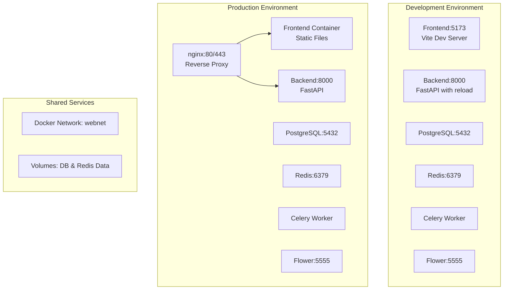

# Design Document

## Overview

This design outlines the restructuring of a full-stack application with FastAPI backend and React frontend to support proper Docker-based deployment in both development and production environments. The solution uses nginx as a reverse proxy in production, optimized Dockerfiles, corrected Docker Compose configurations, and an enhanced deployment script.

## Architecture

### High-Level Architecture



### Service Communication

- **Development**: Direct port access to services for debugging
- **Production**: All traffic routed through nginx reverse proxy
- **Internal**: Services communicate via Docker network using service names
- **External**: nginx handles SSL termination and security headers

## Components and Interfaces

### 1. Frontend Component

#### Development Configuration
- **Container**: React app with Vite dev server
- **Port**: 5173 (exposed for direct access)
- **Volume Mount**: `./frontend:/app` for hot reloading
- **Build**: Development Dockerfile with dev dependencies

#### Production Configuration
- **Container**: Multi-stage build producing static files
- **Serving**: nginx serves built static files
- **Build**: Optimized production Dockerfile
- **Security**: Served through nginx with security headers

### 2. Backend Component

#### Development Configuration
- **Container**: FastAPI with uvicorn reload
- **Port**: 8000 (exposed for direct access)
- **Volume Mount**: `./backend:/usr/src/app` for hot reloading
- **Dependencies**: Wait for PostgreSQL and Redis health checks

#### Production Configuration
- **Container**: FastAPI with production uvicorn settings
- **Port**: 8000 (internal only, accessed via nginx)
- **Security**: Non-root user, optimized for production
- **Dependencies**: Same health check dependencies

### 3. nginx Component

#### Development
- **Status**: Optional/disabled by default
- **Purpose**: Can be enabled for testing routing
- **Configuration**: Basic HTTP routing

#### Production
- **Status**: Required reverse proxy
- **Ports**: 80 (HTTP redirect) and 443 (HTTPS)
- **Configuration**: SSL termination, security headers, rate limiting
- **Routing**: 
  - `/` → Frontend static files
  - `/api/v1/` → Backend service
  - `/.well-known/acme-challenge/` → Certbot validation

### 4. Database and Cache Services

#### PostgreSQL
- **Image**: postgres:16-alpine
- **Health Check**: pg_isready command
- **Volumes**: Persistent data storage
- **Environment**: Configurable via environment files

#### Redis
- **Image**: redis:7-alpine
- **Health Check**: redis-cli ping
- **Volumes**: Persistent data storage
- **Usage**: Cache, Celery broker, and result backend

### 5. Supporting Services

#### Celery Worker
- **Purpose**: Background task processing
- **Dependencies**: Redis and PostgreSQL health checks
- **Configuration**: Same as backend service

#### Flower
- **Purpose**: Celery monitoring
- **Port**: 5555
- **Dependencies**: Redis health check

## Data Models

### Environment Configuration

```yaml
Development Environment:
  - POSTGRES_SERVER: users-db (Docker service name)
  - REDIS_URL: redis://redis:6379/0
  - BACKEND_CORS_ORIGINS: http://localhost:5173
  - Frontend Access: Direct port 5173
  - Backend Access: Direct port 8000

Production Environment:
  - POSTGRES_SERVER: users-db (Docker service name)
  - REDIS_URL: redis://redis:6379/0
  - BACKEND_CORS_ORIGINS: https://banwee.com
  - Frontend Access: Through nginx (port 80/443)
  - Backend Access: Through nginx proxy
```

### Docker Network Configuration

```yaml
Network: webnet
  Type: bridge
  Services:
    - frontend
    - userservice (backend)
    - users-db
    - redis
    - celery_worker
    - flower
    - nginx (production only)
```

## Error Handling

### Container Startup Errors
- **Health Checks**: All critical services have health checks
- **Wait Scripts**: Backend waits for database and Redis availability
- **Retry Logic**: Services retry connections with exponential backoff
- **Logging**: Structured logging with color-coded output

### nginx Error Handling
- **Upstream Failures**: Proper error pages for backend unavailability
- **SSL Errors**: Graceful fallback and certificate validation
- **Rate Limiting**: 429 responses with appropriate headers
- **CORS Errors**: Proper CORS headers for cross-origin requests

### Environment Configuration Errors
- **Validation**: run_docker.sh validates environment selection
- **File Copying**: Automatic environment file selection and copying
- **Missing Files**: Clear error messages for missing configuration files
- **Permission Issues**: Proper file permissions for scripts and certificates

## Testing Strategy

### Development Testing
1. **Service Startup**: Verify all services start successfully
2. **Hot Reloading**: Test frontend and backend code changes
3. **API Connectivity**: Direct API testing on port 8000
4. **Database Connectivity**: Verify PostgreSQL connections
5. **Redis Connectivity**: Verify cache and Celery operations

### Production Testing
1. **nginx Routing**: Test frontend serving and API proxying
2. **SSL Configuration**: Verify HTTPS and certificate handling
3. **Security Headers**: Validate security header implementation
4. **Rate Limiting**: Test API rate limiting functionality
5. **Static File Serving**: Verify optimized frontend asset delivery

### Integration Testing
1. **Cross-Service Communication**: Test service-to-service communication
2. **Data Persistence**: Verify volume mounts and data persistence
3. **Environment Switching**: Test dev to prod environment switching
4. **Cleanup Operations**: Test container and volume cleanup
5. **Error Recovery**: Test service recovery after failures

### Performance Testing
1. **Container Resource Usage**: Monitor CPU and memory usage
2. **nginx Performance**: Test reverse proxy performance
3. **Database Connections**: Test connection pooling and limits
4. **Static File Caching**: Verify frontend asset caching
5. **API Response Times**: Measure API performance through nginx

## Security Considerations

### Container Security
- **Non-root Users**: Production containers run as non-root users
- **Minimal Images**: Use slim/alpine base images
- **Dependency Scanning**: Regular security updates for dependencies
- **Secret Management**: Proper handling of environment variables

### nginx Security
- **SSL/TLS**: Strong cipher suites and protocols
- **Security Headers**: HSTS, CSP, X-Frame-Options, etc.
- **Rate Limiting**: Protection against abuse and DDoS
- **Access Logging**: Comprehensive request logging

### Network Security
- **Internal Communication**: Services communicate via internal Docker network
- **Port Exposure**: Minimal external port exposure in production
- **CORS Configuration**: Strict CORS policies per environment
- **Firewall Rules**: Proper VM-level firewall configuration

## Deployment Strategy

### Development Deployment
1. Run `./run_docker.sh dev up`
2. Services start with development configurations
3. Direct access to services for debugging
4. Hot reloading enabled for rapid development

### Production Deployment
1. Run `./run_docker.sh prod up`
2. Services start with production configurations
3. nginx handles all external traffic
4. SSL certificates managed via Certbot
5. Optimized for performance and security

### Rollback Strategy
- **Container Versioning**: Tagged container images for rollback
- **Volume Persistence**: Data preserved during updates
- **Configuration Backup**: Environment and nginx config backups
- **Health Monitoring**: Automated health checks for deployment validation